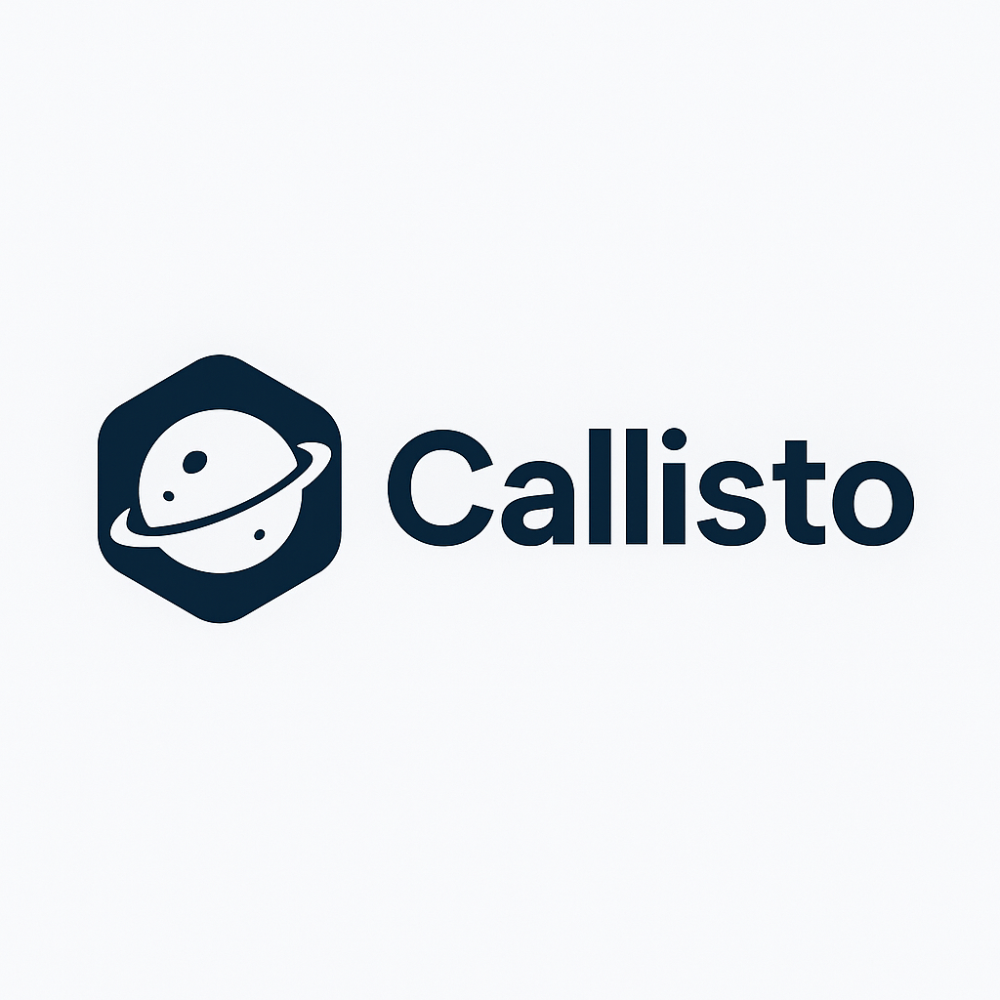

<div align="center">
  
</div>

# Callisto

**Callisto** is a lightweight local HTTP development client built with [Go](https://go.dev/) and [Fyne](https://fyne.io/).  
It provides a simple desktop interface for composing HTTP requests and inspecting responses.  
Perfect for developers who want a fast, distraction-free alternative to heavy API clients.

---

## ✨ Features

- 📝 Compose and send **GET, POST, PUT, DELETE** requests  
- 🔑 Add custom headers and body parameters  
- 🗂️ Manage multiple key/value rows dynamically  
- 📦 View JSON responses with formatting  
- 📜 Response status and headers display  
- ⚡ Built with **Go + Fyne** → runs cross-platform (Linux, macOS, Windows)  
- 🧪 Planned: request history, environment variables, and dark mode  

---

## 🚀 Getting Started

### Prerequisites
- [Go 1.22+](https://go.dev/dl/) installed  
- Git installed  

### Installation & Running

Clone the repository:
```bash
git clone https://github.com/yourusername/callisto.git
cd callisto